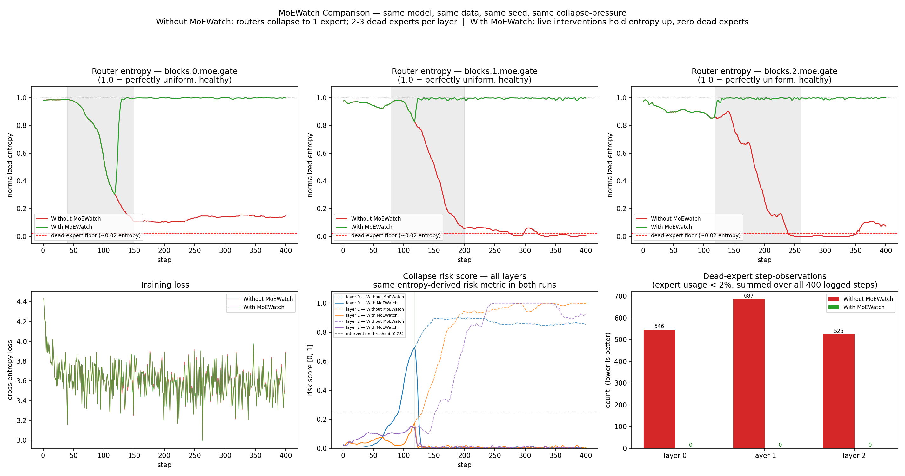

# MoEWatch Comparison

**MoEWatch** is a lightweight monitoring and intervention library for Mixture-of-Experts (MoE) models. It watches router entropy, expert usage, and risk scores in real time, then applies live actions (AuxLoss, RouterNoise, ExpertDropout) when collapse starts — so dead experts never take hold.

This comparison uses the **same** tiny MoE model, synthetic data, seed, optimizer, and collapse-pressure schedule. The only difference is whether MoEWatch is attached.

**Takeaway:** Without MoEWatch the routers silently collapse under sustained pressure (2–3 dead experts per layer). With MoEWatch, interventions keep entropy high and dead-expert counts at zero — same training run, healthy gates.
